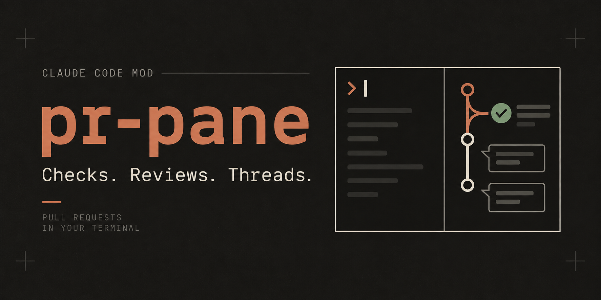

# pr-pane

A Claude Code mod: a live GitHub pull-request pane inside the terminal or
desktop Code tab. Polls `gh` and redraws on change.

## What it shows

- Tabs: the current branch's PR, pinned PRs, and your open PRs.
- Checks with per-check actions: `f` fix (hands the failing check to Claude
  with T3 Code's prompt), `u` rerun failed (`gh run rerun --failed`).
- Reviews, review threads, comments, Greptile scores.
- Merge (`m`) using the repo's allowed method, or a conflict hand-off to Claude
  when the branch conflicts.

Hotkeys: `r` refresh, `o` open in browser, `p` pin, `x` unpin, `s` search,
`b` bots, `t` resolved threads, `k` more/less, `q` close.

## Install

Requires the GitHub CLI (`gh`) logged in.

```bash
git clone https://github.com/Tyru5/claude-pr-pane ~/claude-code-mods/pr-pane
claude --plugin-dir ~/claude-code-mods/pr-pane
```

Or set it permanently in `~/.claude/settings.json`:

```json
{ "env": { "CLAUDE_CODE_PLUGIN_DIRS": "/path/to/claude-pr-pane" } }
```

## Develop

```bash
claude plugin test .
```

`.claude-plugin/types/` is generated by the engine on load and ignored.

## Layout

- `hooks/register.tsx`: state, polling, actions.
- `hooks/view.tsx`: layout tiers and footer keys.
- `hooks/gh.ts`: `gh` argv builders, parsers, prompts.
- `hooks/md.tsx`: markdown rendering for comment bodies.
- `hooks/vendor/`: `mermaid-ascii` (MIT, Craft Docs).
- `tests/pr-pane.test.ts`: suite run by `claude plugin test`.

## Credits

The fix and conflict hand-off prompts are taken verbatim from
[T3 Code](https://github.com/pingdotgg/t3code).

## License

MIT
